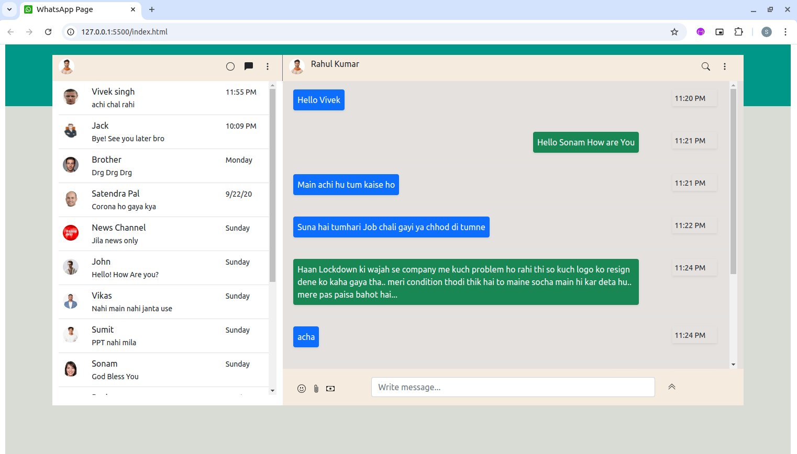

# Whatsapp Page

This project is a replica of the WhatsApp Web interface, created entirely with [HTML](https://developer.mozilla.org/en-US/docs/Web/HTML) and [CSS](https://developer.mozilla.org/en-US/docs/Web/CSS). It captures the look and feel of WhatsApp, featuring a sleek and responsive chat interface, contact list, and message bubbles. Users can explore the design of chat windows, notification icons, and other familiar WhatsApp elements in a simple, single-page layout. This project is ideal for understanding layout structures and responsive design using only basic front-end technologies.

## 🛠 Built With
• [HTML](https://developer.mozilla.org/en-US/docs/Web/HTML)

• [CSS](https://developer.mozilla.org/en-US/docs/Web/CSS)